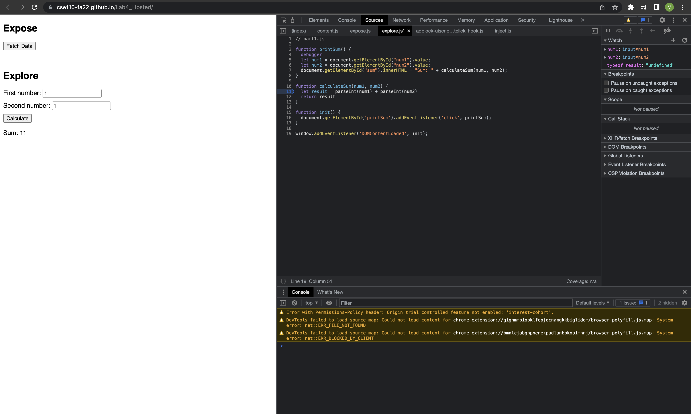

1. The bug is that the program is concatenating the values as strings rather than summing them as numbers.
2. I would fix it by converting num1 and num2 into numbers using the function parseInt().

